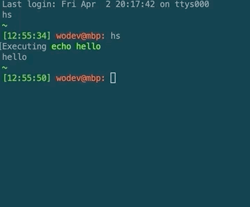

# Overview
This is a small utility written in Rust that allows you to search through the shell history in a slightly more fancy way.

It has no arguments and when invoked it shows a list of the first 10 history entries. 

You can scroll through this list with cursor keys or enter a search term that will narrow the list. 

Pressing Enter will execute the command. 

Esc will cancel out of the utility.




# Installation
You need to have [Rust](https://www.rust-lang.org/tools/install) installed.

Clone this repository and build the utility by executing the following in the root of the repository:
```
cargo build --release
```
This will build the executable into targets/release/hs - you can then copy that file to somewhere in your path.
Alternatively you can use ```install.sh``` which takes an optional argument to be used as the destination path (default is $HOME/bin).

For ultimate fun, you can bind a hotkey to the command, for example with ```bind -x '"\C-h": hs'``` - this should also prevent the command itself becoming part of the history.
